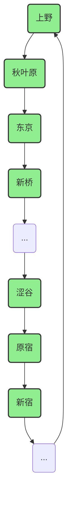
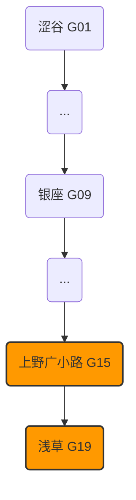
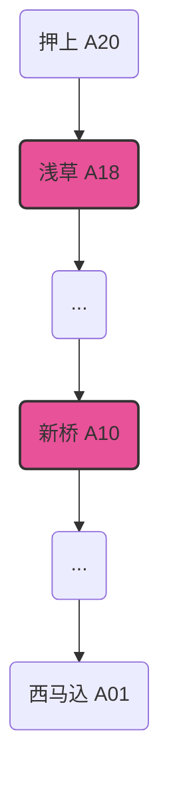
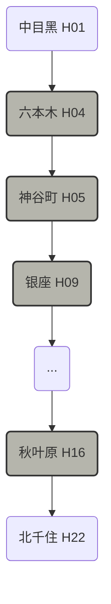
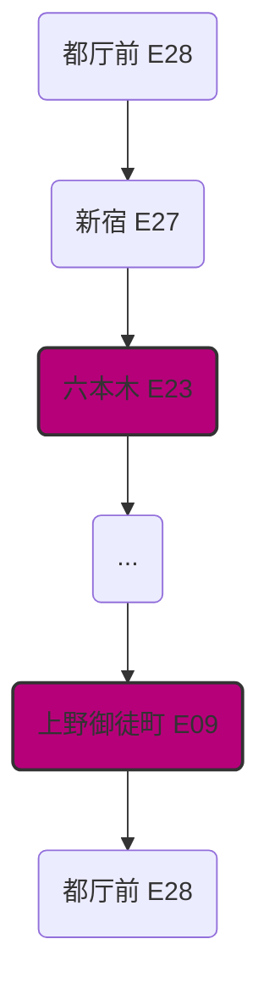

# 🚇 东京行程地铁线路图指南

本指南提取了您7天行程中所有涉及的地铁和JR线路，并为您清晰地标注了需要上下车的站点，帮助您更直观地理解交通路线。

---

## 1. JR山手线 (Yamanote Line) - 绿色

- **简介**: 东京最重要、最方便的环线铁路，连接了几乎所有核心区域。
- **行程中涉及站点**: **上野、秋叶原、东京、新桥、新宿、原宿、涩谷**

---

## 2. 东京Metro银座线 (Ginza Line) - 橙色 (G)

- **简介**: 连接浅草、上野、银座、涩谷等核心商业和观光区。
- **行程中涉及站点**: **上野广小路、浅草**

---

## 3. 都营浅草线 (Asakusa Line) - 红色 (A)

- **简介**: 连接浅草和新桥，是去往横滨的重要换乘线路。
- **行程中涉及站点**: **浅草、新桥**

---

## 4. 东京Metro日比谷线 (Hibiya Line) - 灰色 (H)

- **简介**: 连接秋叶原、银座、六本木等区域。
- **行程中涉及站点**: **秋叶原、银座、神谷町、六本木**

---

## 5. 都营大江户线 (Oedo Line) - 紫红色 (E)

- **简介**: 东京的另一条环线，可以从六本木方便地返回上野地区。
- **行程中涉及站点**: **六本木、上野御徒町**

---

## 6. 其他重要线路

- **京成Skyliner**: **成田机场 ↔ 京成上野** (机场快线)
- **JR上野东京线**: **上野 ↔ 横滨 / 镰仓** (长途线路)
- **港未来线**: **横滨 ↔ 马车道** (横滨市内线路)
- **江之电**: **镰仓 ↔ 镰仓高校前 / 长谷** (镰仓市内观光电车)
- **成田特快N'EX**: **涩谷 ↔ 成田机场** (机场快线)

希望这份指南能帮助您更轻松地玩转东京！
